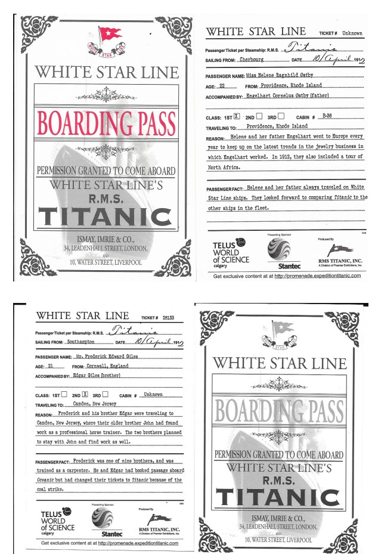

# Asignatura Machine-Learning UDD - MSc Data Science

## Tarea III: Análisis Supervisado

### Objetivo
El objetivo de esta tarea es aplicar algoritmos de aprendizaje supervisado utilizando los siguientes conjuntos de datos:

- **Cáncer de mama** (load_breast_cancer)
- **Titanic**

Junto con el uso de las funciones útiles de la librería **scikit-learn**, se deberá realizar un análisis de los datos que incluya:

- Ingeniería de características.
- Aplicación de al menos un método de aprendizaje **no supervisado**.
- Aplicación de **Naive Bayes**, **Análisis Discriminante** y **Regresión Logística** para evaluar el rendimiento de modelos supervisados.

Además, para el dataset de Titanic, se investigará si la **edad** es un factor determinante para la supervivencia y se predecirá el destino de dos pasajeros con boletos específicos.

